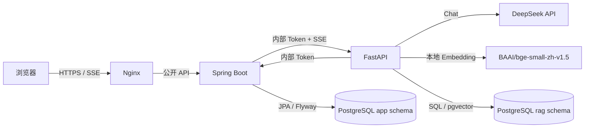
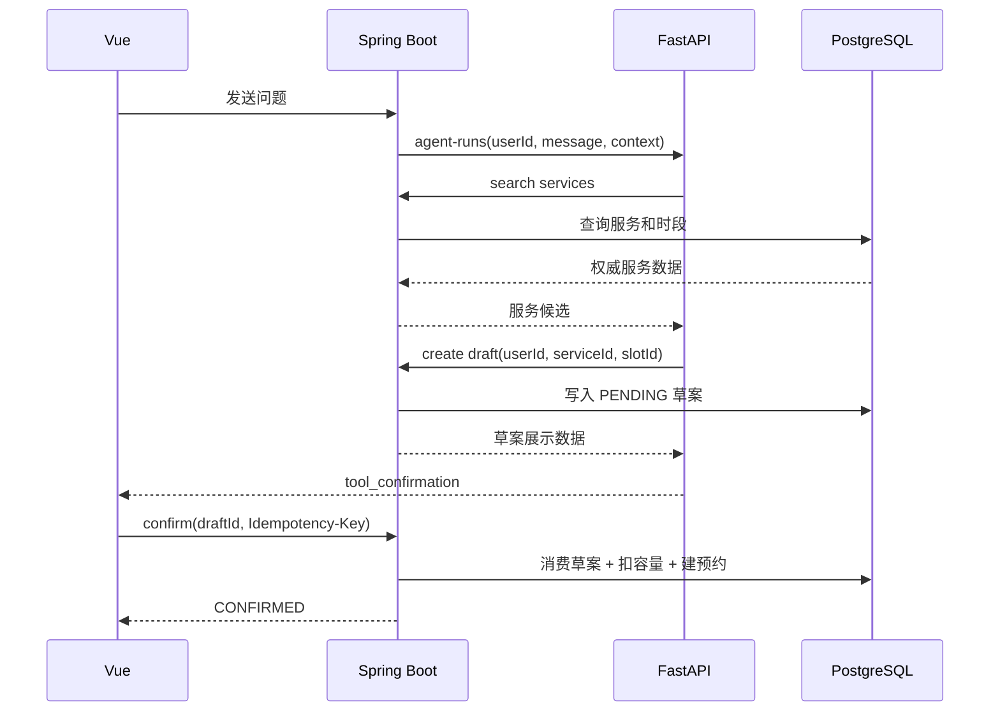

# 系统架构与数据流

## 技术栈

| 层 | 技术 | 主要职责 |
|---|---|---|
| Web | Vue 3、TypeScript、Vite、Element Plus | 登录、问答、引用、服务卡片、草案确认、预约列表 |
| 网关 | Nginx | 静态资源、公开 API 转发、SSE 配置 |
| 业务服务 | Java 17、Spring Boot 3、Spring Security、JPA、Flyway | 用户、服务、草案、预约、事务、关键审计 |
| AI 服务 | Python、FastAPI、DeepSeek OpenAI-compatible client、Sentence Transformers | 导入、切片、本地 Embedding、检索、问答、工具编排、评测 |
| 数据库 | PostgreSQL、pgvector | `app` 与 `rag` 两个 schema |
| 运行方式 | Docker Compose、GitHub Actions | 本地演示、构建和验证 |

MVP 不使用 Redis。未来服务目录缓存放在 Java `ServiceQueryService` 与 Repository 之间，登录限流状态迁移到 Redis；不缓存完整对话和模型答案。

## 组件关系



浏览器永远不直接访问 Python。Python 内部接口和 Java 工具接口不在 Nginx 公开路由中。

## 为什么按两个服务拆分

- Spring Boot 负责具有事务、权限和一致性要求的业务状态。
- FastAPI 负责变化更快的模型、Embedding、文档解析和评测能力。
- 模型输出不进入核心业务事务。
- Python 崩溃不会绕过 Java 的预约确认和容量约束。
- 使用 Python AI 生态可以展示岗位要求的模型集成能力，因此 MVP 不再引入 Spring AI 或 LangChain4j。

## 问答数据流

1. 浏览器向 Java 提交当前问题和最多一组上一轮问答。
2. Java 从 JWT 得到 `userId`，校验会话归属、消息数量和长度。
3. Java 创建规范化 `requestId`，记录消息元数据。
4. Java 通过内部 Token 调用 Python `agent-runs`。
5. Python识别政策、服务或混合意图。
6. 政策问题执行 Embedding 与 pgvector Top K 检索。
7. Python 检查引用是否存在，必要时拒答。
8. 服务问题由 Python 调用 Java 的只读服务查询接口。
9. 混合问题可在政策检索后查询服务，并请求 Java 生成预约草案。
10. Python 以 SSE 返回状态、答案片段、引用和草案。
11. Java 原样保留事件语义并代理给浏览器。
12. 任一层检测到下游断开时，向上游传播取消。

## 预约数据流



模型和浏览器提供的价格、服务名称或时间都不可信。最终数据只从数据库读取。

## RAG MVP 流程

```text
规范化问题
  → 生成中文 Embedding
  → pgvector 相似度 Top K
  → 相似度阈值
  → 引用存在性与来源校验
  → 基于检索片段生成答案
  → 返回答案和引用，或拒答
```

按时间依次增强：

1. 标题关键词弱信号
2. 语义与关键词加权
3. RRF
4. LLM 相关性过滤
5. 独立幻觉检查

不得为了实现增强项延误 Java 预约闭环。

## 中文文档策略

- 首选人工核对后的 Markdown。
- 文本型 PDF 可自动解析，但必须保留页码。
- 扫描件、复杂表格或严重页眉污染直接转为 Markdown。
- 每份文档保存标题、机构、生效日期、来源 URL、SHA-256 和处理方式。
- PostgreSQL 中文全文能力只作为弱信号，不安装 `zhparser`。

## SSE 约束

Nginx 的 SSE 路径必须包含：

```nginx
proxy_buffering off;
proxy_cache off;
proxy_read_timeout 300s;
proxy_send_timeout 300s;
```

取消链路：

```text
AbortController
  → Java 取消上游订阅
  → Python 检测 disconnect / CancelledError
  → 关闭 MaaS 流式请求
```

Request ID：

- Java 接收合法 UUID，否则生成新 UUID。
- Java 将规范化 ID 写入请求体和 `X-Request-ID`。
- Python调用 Java 工具时继续携带相同 ID。
- 结构化日志至少包含 `request_id`、`user_id`、`conversation_id`、`stage`、`duration_ms`、`provider_duration_ms`、`status` 和 `error_code`。

## Compose 增量

- 周 2：只启动 PostgreSQL/pgvector；初始化脚本创建 `vector` 扩展和 `rag` 表。
- 周 3：加入 Spring Boot；Flyway 管理 `app` schema。
- 周 4：加入 FastAPI、内部网络和 Nginx SSE 配置。
- 周 5：加入 Vue 构建产物。
- 周 6：补健康检查、启动顺序、资源配置和冒烟测试。
